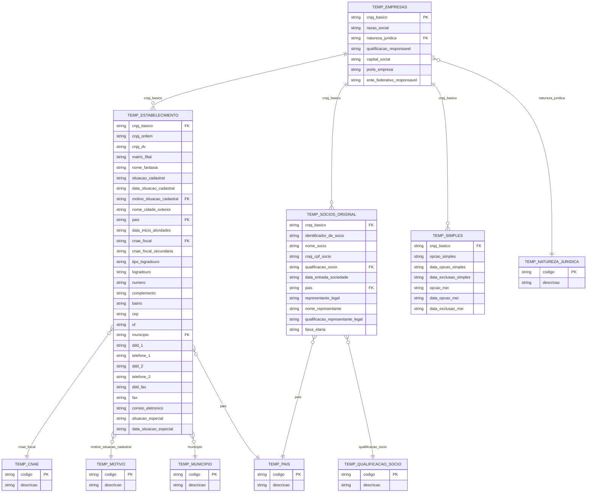

# 🇧🇷 CNPJ Data Pipeline  
### Turning Brazil’s official CNPJ ZIP files into a clean analytics warehouse + dashboard  
**Airflow • PostgreSQL • Streamlit • Docker Compose**

<div align="center">

<!-- Badges -->


<br/><br/>

<!-- Icons -->


</div>

---

## 👋 Hey! What this is?

Brazil’s government publishes the **official CNPJ company registry** as **large ZIP files**.  
Those files are not analysis-ready: they come raw, with inconsistent formats and common data issues.

This repository is a **data factory** that turns those ZIPs into something useful:

1. **Download** official ZIP files  
2. **Unzip + load** into a database (staging layer)  
3. **Clean + validate** (fix known issues, normalize formats)  
4. **Publish** only validated data into a curated “final” layer  
5. **Visualize** the curated data in a dashboard (Streamlit)

✅ **Outcome:** raw public files become a **clean analytics database** + a **dashboard**, fully runnable locally with Docker.

---

## 🎯 Why it matters (business value)

A reliable CNPJ dataset supports real business use cases:

- **Fraud & Risk:** detect suspicious networks across addresses, partners, patterns
- **Compliance & KYC:** confirm company status and official registration information
- **Market intelligence:** distribution by state/city/industry (CNAE)
- **Sales & enrichment:** segment companies by region, type, and activity

This project also demonstrates a **production-shaped mindset**: safe access, repeatability, and clear separation of responsibilities.

---

## ✅ What this project delivers

- **End-to-end ETL:** download → unzip → staging → validate/transform → promote → consume
- **Typed staging schema** (`temp_...`) aligned to official layouts
- **Curated final layer** (clean tables and analytics-friendly views)
- **Streamlit dashboard** querying the curated layer using a **read-only DB user**
- **Fully reproducible local environment** using Docker Compose
- **Rollback-safe publishing:** final tables update only when a run succeeds

---

## 🧱 Stack (one line each)

- **Docker Compose** — starts everything with one command  
- **Apache Airflow** — orchestrates and schedules pipeline steps  
- **PostgreSQL 15** — warehouse storage for staging + curated data  
- **Streamlit** — interactive analytics dashboard  

---

## 🗺️ Architecture (local)


### Components (what runs locally)

| Component | What it does | Why it exists |
|---|---|---|
| Receita Federal ZIPs | Official public dataset | Real ingestion source |
| Airflow | Executes pipeline steps | Automation and reliability |
| PostgreSQL | Stores the warehouse | Durable, queryable foundation |
| Streamlit | Dashboard UI | Delivers the data product |
| Docker Compose | Runs services together | Reproducibility anywhere |

---

## 🔐 Security model (simple and real-world)

This project follows a safe pattern: **one user writes, one user only reads**.

### Database users

- **`airflow`** → READ/WRITE  
  Used only by the pipeline (load, transform, promote)

- **`app_ro`** → READ-ONLY  
  Used only by Streamlit (dashboard queries)

✅ The dashboard cannot write to the database  
✅ Staging tables are isolated from final tables  
✅ Promotion uses transactions (rollback-safe)

---

## 🔄 Data flow (ETL pipeline)

### Plain

1. **Extract** — download ZIPs and unzip raw files  
2. **Load (staging)** — load into typed staging tables (`temp_...`)  
3. **Validate & transform** — fix invalid dates, normalize nulls, enforce types  
4. **Promote (final)** — publish curated data into final tables inside a transaction  
5. **Consume** — Streamlit reads curated tables/views using `app_ro`

---

## 🧩 Database structure (staging vs curated)

This project stores the CNPJ dataset in PostgreSQL using a **two-layer warehouse design**:

### 1) Staging layer (`temp_*`)
Staging tables are the **landing zone** for raw government files. They are **typed** (so validation is possible) and **closely follow Receita Federal layouts**, but they are **not the final analytics layer**.

**Why staging exists:**
- keeps raw ingestion isolated (safe for reprocessing)
- allows validation and cleanup before publishing
- prevents incomplete or broken loads from reaching BI/dashboard users

### 2) Curated / final layer (analytics-ready)
After validation, data is **promoted** into curated tables and/or views designed for analytics:
- consistent formats (dates, nulls, codes)
- query-friendly structure
- stable layer for dashboards and BI tools

Only this layer is consumed by the Streamlit app.

---

### Core tables (what they represent)

The staging schema mirrors the main “business entities” in the dataset:

- **`TEMP_EMPRESAS`** — company-level information (one row per `cnpj_basico`)  
  Example: corporate name, legal nature, company size/porte.

- **`TEMP_ESTABELECIMENTO`** — establishment/unit information (HQ + branches)  
  Example: address, state (**UF**), city/municipality, main CNAE, registration status.

- **`TEMP_SOCIOS_ORIGINAL`** — partners/shareholders linked to each company  
  Example: partner name, qualification, entry date, country, representative.

- **`TEMP_SIMPLES`** — SIMPLES/MEI tax regime flags and dates  
  Example: whether the company opted into SIMPLES or MEI and when.

---

### Reference tables (code-to-description dictionaries)

Several columns in the dataset are “codes”. These reference tables translate them into human-readable descriptions:

- **`TEMP_CNAE`** — economic activity codes and descriptions  
- **`TEMP_MUNICIPIO`** — municipality codes and names  
- **`TEMP_PAIS`** — country codes and names  
- **`TEMP_MOTIVO`** — reason codes for registration status changes  
- **`TEMP_NATUREZA_JURIDICA`** — legal nature codes and descriptions  
- **`TEMP_QUALIFICACAO_SOCIO`** — partner qualification codes and descriptions

---

## 🗂️ Project tour (where things live)

- **`compose.yaml`** / **`docker-compose.override.yml`** → local infrastructure (services, ports, volumes)
- **`airflow/dags/`** → pipeline DAGs (download, ingest, process, cleanup)
- **`airflow/datasets/`** → downloaded ZIPs + extracted CSVs (pipeline artifacts)
- **`airflow/logs/`** → Airflow logs (scheduler, dag processor, etc.)
- **`streamlit_app/`** → Streamlit app, pages, UI components, database access
- **`streamlit_app/utils/pages/geografia.py`** → geography page (Brazil choropleth)
- **`streamlit_app/assets/br_states.geojson`** → Brazil states geometry for mapping
- **`docker/airflow/`** and **`docker/streamlit/`** → custom Dockerfiles for containers
- **`notebooks/`** → experiments and development notebooks

---

## 🚀 Getting started (run it on any machine)

### Prerequisites
- Docker + Docker Compose installed  
That’s it ✅

### 1) Start the stack
If you have a Makefile shortcut:
```bash
make init
```
### How tables connect?

At the center is **`cnpj_basico`**, which links the main entities:

- One company (`TEMP_EMPRESAS`) can have many establishments (`TEMP_ESTABELECIMENTO`)
- One company can have many partners (`TEMP_SOCIOS_ORIGINAL`)
- One company can have one SIMPLES/MEI record (`TEMP_SIMPLES`)

Establishments and partners also connect to reference tables (CNAE, municipality, country, etc.)
to enrich analytics and make dashboards readable.

> See the ER diagram below for the full relationship map.


## ✅ Mermaid (GitHub-safe): Pipeline flow

```mermaid
flowchart TB
  A[Receita Federal CNPJ ZIP files]

  subgraph ETL_Pipeline[ETL Pipeline - Airflow]
    B[Extract: download and unzip]
    C[Load: typed staging tables]
    D[Validate: fix dates, nulls, types]
    E[Promote: publish to curated final layer]
  end

  subgraph Warehouse[PostgreSQL Warehouse]
    S[(Staging schema)]
    F[(Final curated tables and views)]
  end

  subgraph Product[Data Product]
    G[Streamlit dashboard - read only]
  end

  A --> B
  B --> C
  C --> S
  S --> D
  D --> E
  E --> F
  F --> G


